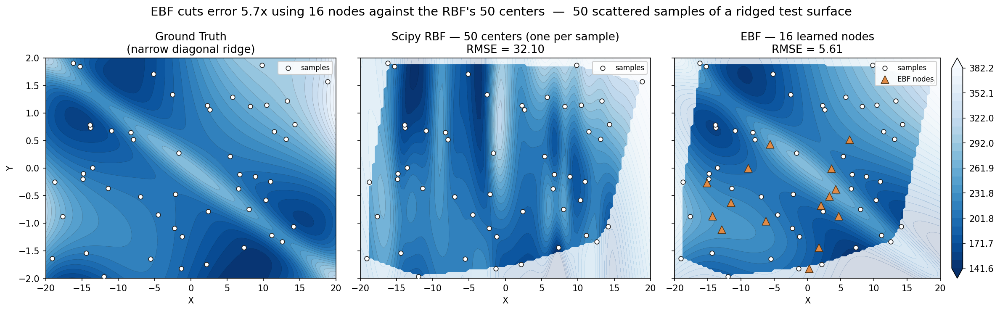
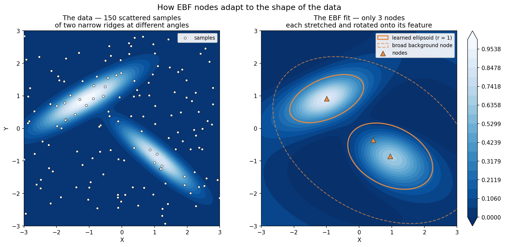

# EBF — Elliptical Basis Function Interpolation

Extract smooth functional relationships from scattered, arbitrarily-dimensioned engineering
data. EBF generalizes Radial Basis Function (RBF) interpolation by giving **every node its
own learnable ellipsoid** instead of a single shared spherical radius — so instead of
assuming what "distance" means between your variables, the model learns it.



*50 scattered samples of a surface with a narrow diagonal ridge. Scipy's RBF places a center
at every sample (50 of them) and still rings around the ridge — RMSE 32.10. EBF uses 16
learned nodes and follows it — RMSE 5.61. Both are scored against ground truth inside the
convex hull of the samples; the faint regions outside it are extrapolation, shown for
context. Reproduce with [`examples/RBF_vs_EBF.py`](examples/RBF_vs_EBF.py).*

## What Makes It Different

A conventional RBF measures distance from every center with one shared, circular metric, so
a center can only ever cover a round patch. An EBF node carries its own positive-definite
matrix `Aᵢ`, and the optimizer is free to stretch and rotate it during training.



*Three nodes fit to two narrow ridges at +30° and −40°. Two nodes elongate and turn onto a
ridge each; the third stays broad and carries the background. Nothing instructs the model to
do this — it falls out of minimizing fit error. Reproduce with
[`examples/node_ellipsoids.py`](examples/node_ellipsoids.py).*

The model equation:

```
ŷ = Σᵢ aᵢ · φ(rᵢ²) + b₁·x + b₂
```

where `rᵢ² = (x − vᵢ)ᵀ Aᵢ (x − vᵢ)` and each `Aᵢ = LᵢLᵢᵀ + εI` is guaranteed positive-definite
via Cholesky factorization. A global linear trend term captures broad gradients, while the
basis function sum captures nonlinear detail.

See [`ALGORITHM.md`](ALGORITHM.md) for the full derivation.

### Why This Matters More As Dimensions Grow

RBF interpolation carries an assumption inherited from the spatial problems it was invented
for: that the input space is **Euclidean**, so distance means something. For latitude and
longitude that holds — two points a kilometre apart are physically related, and a circular
kernel encodes that correctly.

Engineering data rarely works this way. When your axes are speed, power, temperature,
pressure, mass, and price, there is no common unit and therefore no natural notion of
distance. How far is 10 kPa from 3 °C? Standardizing each axis to unit variance — which EBF
does automatically — supplies a default answer, but that is a *guess*, not a physical fact.

**The per-node ellipsoid is that guess made learnable.** Rather than assuming a metric, the
optimizer infers one from the data. And because each `Aᵢ` is a full symmetric matrix rather
than a per-axis scaling, it can rotate as well as stretch — so the model can capture that two
variables act *together*, not just that one matters more than another. Each node carries its
own, so the inferred relationship is free to differ across the space: the metric that fits
one operating region need not be the metric that fits another.

This is why the advantage tends to widen with dimensionality. In 2-D you can often eyeball a
sensible scaling; in 6-D, with mixed units and interactions, you generally cannot.

## Features

- **Per-node learnable ellipsoids** — each node adapts its own anisotropic distance metric
- **Any number of inputs** — 1-D, 2-D, or 20-D; the fit, export, and diagnostics don't care
- **12 basis functions** — multiquadric (default), Gaussian, Matern, thin plate, cubic, and more
- **Robust losses** — Huber downweights outliers, Tukey rejects them outright; both
  self-calibrate to the residual noise floor
- **Automatic data standardization** — inputs and outputs are scaled internally; predictions
  come back in original units
- **Early stopping** — optional validation split with best-weight restore
- **Visualization and export** — diagnostic plots, contour maps, and CSV/NPZ lookup tables
- **Save/load** — TensorFlow checkpoints with a JSON sidecar for full reproducibility

## Installation

```bash
pip install git+https://github.com/jreyenga/EBF.git
```

or with poetry:

```bash
poetry add git+https://github.com/jreyenga/EBF.git
```

Requires Python >= 3.11 and TensorFlow >= 2.21. Additional dependencies (matplotlib, scipy,
pandas, openpyxl) install automatically. For a development install, see
[Contributing](#contributing).

## Quick Start

Akima's benchmark dataset — a long flat run followed by a steep rise, where splines tend to
overshoot:

```python
import numpy as np
import ebf

x = np.array([0, 2, 3, 5, 6, 8, 9, 11, 12, 14, 15], dtype=float)
y = np.array([10, 10, 10, 10, 10, 10, 10.5, 15, 50, 60, 85])
X = x.reshape(-1, 1)                 # inputs are always 2-D: (n_points, n_dims)

model = ebf.EBF(n_nodes=11)
model.fit(X, y, steps=20000, var_weight=0.5, seed=42)

# Predict anywhere — not just at the training points
query = np.linspace(x.min(), x.max(), 200).reshape(-1, 1)
y_fit = model.predict(query)
```

Full script: [`examples/1d_fit.py`](examples/1d_fit.py).

**Data contract:** inputs are `(n_points, n_dims)` and outputs `(n_points,)`. You can also
pass a single combined `(n_points, n_dims+1)` array, in which case **the last column is
always the output**:

```python
data = np.column_stack([x1, x2, y])
model.fit(data)                      # last column treated as the output
```

## Typical Workflow

Fit, check the fit, look at the surface, export it. Every plotting helper accepts an `ax=`
argument so you can compose figures, and returns `(fig, ax)`.

```python
import ebf

# 1. Fit
model = ebf.EBF(n_nodes=16, basis='multiquadric')
model.fit(X, y, steps=60000, var_weight=0.1, seed=42)

# 2. Diagnose — did it converge, and is the fit any good?
ebf.convergence_plot(model)          # loss curve from model.history_
ebf.correlation_plot(y, model.predict(X))   # data vs prediction, with R²
ebf.residual_plot(y, model.predict(X))      # bias trends and outliers

# 3. Inspect the surface (2-D inputs)
ebf.contour_plot_2d(model, X, y, show_nodes=True,
                    xlabel='X1', ylabel='X2', zlabel='Y')

# 4. Or get all four diagnostics in one figure
ebf.summary_plot_3d(model, X, y, xlabel='X1', ylabel='X2', zlabel='Y')

# 5. Export a lookup table for use elsewhere
bounds = list(zip(X.min(axis=0), X.max(axis=0)))
grid = ebf.eval_grid(model, bounds, n_points=100)
ebf.export_grid("lookup.csv", grid, dim_names=['X1', 'X2'])
```

`eval_grid()` works in any number of dimensions; `export_grid()` writes `.csv` (portable) or
`.npz` (compact, full precision). Contour plots mask everything outside the convex hull of
your training data by default, so you don't mistake extrapolation for a fit.

Full details in [`docs/visualization.md`](docs/visualization.md).

### One figure, whole fit

`summary_plot_3d()` is step 4 above — it composes the surface and all three diagnostics into
a single figure. This is a compressor efficiency map: 56 operating points, 9 nodes.


*Left: the fitted efficiency surface, with training data (white) and the learned node
positions (orange). Right, top to bottom: prediction vs data with R² = 0.9964; residuals
vs prediction, RMSE 0.0083 — about 1.3% of the 0.184–0.843 efficiency range, with one point
standing clearly apart; and the training loss, which hit its `loss_threshold` after 11,783 of
the 80,000 requested steps. Reproduce with
[`examples/comp_map_ebf.py`](examples/comp_map_ebf.py).*

Read together these answer the three questions worth asking of any fit: **is it accurate**
(correlation), **is it wrong anywhere in particular** (residuals), and **did it actually
converge** (loss curve). The residual panel is the one that earns its keep — that single
outlier near prediction 0.5 is invisible on the correlation plot, which compresses it against
the 1:1 line.

### Inspecting what was learned

```python
nodes = model.get_nodes()            # (n_nodes, n_dims) centers, original units
A     = model.get_ellipsoids()       # (n_nodes, n_dims, n_dims) ellipsoid matrices
```

`get_ellipsoids()` returns the `Aᵢ` in the same units as `get_nodes()`, so the two compose
directly — eigen-decompose `A` to recover each node's axis lengths and orientation.

## Working in Any Number of Dimensions

**The examples in this repository are almost all 2-D because two inputs and one output are
what a contour plot can show — not because the method is limited to them.** Fitting is
dimension-agnostic: `n_dims` is inferred from your data, and nothing in the model, the
training loop, or the export path assumes a particular count.

```python
# 5 inputs -> 1 output, no different from the 2-D case
X = measurements[:, :5]        # speed, power, temperature, pressure, mass
y = measurements[:, 5]         # the quantity you care about

model = ebf.EBF(n_nodes=24)
model.fit(X, y, steps=60000, seed=42)

y_hat = model.predict(X_new)   # (n_points, 5) in, (n_points,) out
A     = model.get_ellipsoids() # (24, 5, 5) — the learned metric per node
```

What changes with dimensionality is only what you can *draw*:

| Capability | Dimensions |
|------------|------------|
| `fit`, `predict`, `get_nodes`, `get_ellipsoids`, `save`/`load` | any |
| `convergence_plot`, `correlation_plot`, `residual_plot` | any |
| `eval_grid`, `export_grid` | any |
| `contour_plot_2d` | 2 inputs only |
| `summary_plot_3d` | 2 inputs + 1 output only |

Above two inputs, lean on `correlation_plot` and `residual_plot` — they judge fit quality
from paired arrays and never need to see the input space. To *look* at a high-dimensional
surface, hold the other inputs fixed and sweep two of them with `eval_grid`, which produces
a 2-D slice you can contour.

> **Grid size grows exponentially.** `eval_grid` evaluates `n_points ** n_dims` locations.
> The 100×100 grid that is routine in 2-D becomes 10¹⁰ points in 5-D. Use a coarse
> `n_points`, or pass a list to set the resolution per dimension and spend it only where the
> response actually varies.

### The low end

1-D works too, and [`examples/1d_fit.py`](examples/1d_fit.py) demonstrates it — though it is
admittedly overkill. With a single input there is no cross-dimensional relationship left to
learn, so each ellipsoid collapses to a scalar width and EBF reduces to something close to a
conventional RBF. The one thing you still gain is that **node locations are trainable**, so
centers migrate toward the regions that need them rather than sitting where you put them.

The interesting case is the other direction.

## Choosing Parameters

Constructor (`ebf.EBF(...)`):

| Parameter | Default | Description |
|-----------|---------|-------------|
| `n_nodes` | — | Number of EBF nodes (more nodes = more detail) |
| `basis` | `'multiquadric'` | Basis function name — see [Basis Functions](#basis-functions) |
| `eps` | 1e-8 | Numerical stability offset (only `cosh` / `inv_cosh` use it) |

Training (`model.fit(...)`):

| Parameter | Default | Description |
|-----------|---------|-------------|
| `steps` | 60000 | Training iterations |
| `lr` | 0.01 | Initial Adam learning rate (decays exponentially) |
| `var_weight` | 0.2 | Node spread regularization — higher values produce smoother fits |
| `ellipsoid_weight` | 0.0 | Ellipsoid shape penalty — the explicit smoothness knob; 0 disables it |
| `loss_type` | `'rmse'` | `'rmse'`, `'huber'` (downweights outliers), or `'tukey'` (rejects outliers) |
| `huber_delta` | `'auto'` | Huber threshold — `'auto'` tracks the residual noise floor; a float fixes it |
| `tukey_c` | `'auto'` | Tukey rejection point — residuals beyond it exert zero pull; keep `'auto'` |
| `val_fraction` | 0.0 | Held-out fraction for early stopping; 0 disables. Needs ~50+ points |
| `patience` | 10 | Validation evaluations (1 per 100 steps) without improvement before stopping |
| `loss_threshold` | None | Stop early once the training loss reaches this value; `None` disables |
| `verbose` | True | Print training progress every 100 steps |
| `seed` | None | Set for reproducible results |

**Start here:** `n_nodes` at roughly 1/3 to 1/2 your point count, everything else default.
Then:

| Symptom | Try |
|---------|-----|
| Surface is too wiggly / chases noise | Raise `ellipsoid_weight` (start at `0.001`), then `var_weight` |
| Surface is too flat, misses real features | Lower `var_weight`, add nodes |
| Nodes visibly cluster on top of each other | Raise `var_weight` |
| A few bad measurements drag the surface | `loss_type='huber'` |
| Some points are outright wrong | `loss_type='tukey'` |
| Loss still falling at the last step | Raise `steps` |
| Noisy data, unsure when to stop | `val_fraction=0.15` (needs ~50+ points) |

`var_weight` and `ellipsoid_weight` are the two smoothing knobs. `var_weight` pushes nodes
apart, which broadens their influence zones indirectly; `ellipsoid_weight` penalizes sharp
ellipsoids directly, so reach for it first when a fit is too wiggly.

## Robust Fitting

Real measurements contain noise and the occasional bad point. `loss_type` controls how hard
a residual pulls on the surface.


*Same surface, fit three ways under two corruption scenarios, each scored against clean
ground truth. With noise alone all three land within ~10% of each other (rmse 7.81, huber
7.71, tukey 8.44). Add just two gross outliers and squared error collapses — RMSE 23.33,
with a visible gash torn across the surface — while both robust losses hold near 7.2 (huber
7.21, tukey 7.57). Reproduce with [`examples/loss_comparison.py`](examples/loss_comparison.py).*

**Huber is the sensible default.** It was at least as good as Tukey in both scenarios above
and degrades gracefully. Tukey earns its keep when outliers are numerous or extreme enough
that even Huber's bounded pull still drags the surface. Both thresholds self-calibrate from
the residual spread when left at `'auto'`.

## Basis Functions

Select a basis function by name when creating the model:

```python
model = ebf.EBF(n_nodes=16, basis='gaussian')
```

| Name | Expression |
|------|---|
| `multiquadric` (default) | `a₁ · (√(r²+1) − 1)` |
| `gaussian` | `a₁ · exp(−r²)` |
| `linear` | `a₁ · r` |
| `quadratic` | `a₁ · r²` |
| `cubic` | `a₁ · r³` |
| `thin_plate` | `a₁ · r² ln(r²)` |
| `inv_multiquadric` | `a₁ / √(r²+1)` |
| `inv_quadratic` | `a₁ / (1+r²)` |
| `matern32` | `a₁ · (1+√3·r) · exp(−√3·r)` |
| `matern52` | `a₁ · (1+√5·r+⅗r²) · exp(−√5·r)` |
| `cosh` | `a₁ · cosh(√(r²+ε))` |
| `inv_cosh` | `a₁ / cosh(√(r²+ε))` |

**Growing** functions (`multiquadric`, `linear`, `quadratic`, `cubic`, `thin_plate`, `cosh`)
give every node global reach. **Decaying** functions (`gaussian`, `inv_*`, `matern*`) keep
node influence local, which limits wild extrapolation outside the data hull.

See [`docs/basis_functions.md`](docs/basis_functions.md) for the visual gallery and guidance.

## Saving and Loading

```python
ckpt = model.save("checkpoints/", filename="my-model")

model = ebf.EBF.load(ckpt)           # returns a fitted EBF instance
y_pred = model.predict(X_new)
```

The checkpoint stores the weights, the basis configuration, and the Scale/Offset values
needed to move between scaled and original units.

## Functional API

A lower-level interface is also available for callers that prefer to manage state
themselves:

```python
Scale, Offset, file = ebf.run(data, n_nodes=32, train_steps=20000)
predictions, nodes = ebf.run_points(data[:, :-1], Scale, Offset, file)
```

`run_points()` reads Scale/Offset from the checkpoint's JSON sidecar when you omit them. The
`EBF` class is the recommended entry point for new code.

## Examples

Most of these fit a 2-D surface, because two inputs and one output are what a contour plot
can display — see [Working in Any Number of Dimensions](#working-in-any-number-of-dimensions)
for using EBF beyond that.

| Script | What it shows |
|--------|---------------|
| [`RBF_vs_EBF.py`](examples/RBF_vs_EBF.py) | **Start here.** Head-to-head accuracy against scipy's RBF |
| [`node_ellipsoids.py`](examples/node_ellipsoids.py) | Minimal illustration of how nodes adapt their shape |
| [`comp_map_ebf.py`](examples/comp_map_ebf.py) | Full workflow on a compressor map — every fit parameter and every plot/export tool |
| [`1d_fit.py`](examples/1d_fit.py) | Smallest end-to-end fit, no data file needed |
| [`loss_comparison.py`](examples/loss_comparison.py) | rmse vs huber vs tukey on noisy and corrupted data |
| [`basis_function_gallery.py`](examples/basis_function_gallery.py) | Plots every registered basis function |
| [`loss_function_gallery.py`](examples/loss_function_gallery.py) | Loss and influence curves for the three loss types |

Every script takes `--save-only` to skip the interactive window. The figures embedded in
this README and the docs site are produced by these scripts, not checked in by hand —
regenerate them all with:

```bash
python examples/make_docs_figures.py
```

## Documentation

**[Read the documentation online →](https://jreyenga.github.io/EBF/)**

| Page | Contents |
|------|----------|
| [`docs/algorithm_overview.md`](docs/algorithm_overview.md) | Plain-language guide to how EBF works |
| [`ALGORITHM.md`](ALGORITHM.md) | Model equation, tensor shapes, loss, optimizer |
| [`docs/basis_functions.md`](docs/basis_functions.md) | Basis function reference and gallery |
| [`docs/loss_types.md`](docs/loss_types.md) | Noise and outlier handling — rmse vs huber vs tukey |
| [`docs/visualization.md`](docs/visualization.md) | Plotting and lookup-table export |
| [`docs/api.md`](docs/api.md) | API reference (generated from docstrings) |
| [`docs/examples/rbf_vs_ebf.md`](docs/examples/rbf_vs_ebf.md) | The headline comparison, annotated |
| [`docs/examples/compressor_map.md`](docs/examples/compressor_map.md) | Annotated compressor map walkthrough |

Build the docs site locally with `poetry install --with dev && mkdocs serve`, then open
`http://127.0.0.1:8000`.

## Contributing

```bash
git clone https://github.com/jreyenga/EBF.git
cd EBF
pip install poetry
poetry install --with dev
poetry run pytest
```

Design documentation lives in [`docs/design/`](docs/design):

| File | Contents |
|------|----------|
| [`DECISIONS.md`](docs/design/DECISIONS.md) | Architecture decision records — **read the relevant ADR before changing core algorithm logic** |
| [`CONVENTIONS.md`](docs/design/CONVENTIONS.md) | Naming rules, tensor shape notation, data contract |
| [`ROADMAP.md`](docs/design/ROADMAP.md) | Status, open work, planned features |
| [`SMOOTHNESS.md`](docs/design/SMOOTHNESS.md) | Noise and smoothness research |
| [`SESSION_LOG.md`](docs/design/SESSION_LOG.md) | Decisions not otherwise captured in git history |

Several ADRs are load-bearing: ADR-001 (`band_part` on the ellipsoid weights), ADR-002 (the
node-spread regularizer), and ADR-010 (why an L2 amplitude penalty was tried and rejected)
each document a change that looks like a safe simplification but is not.

[`CLAUDE.md`](CLAUDE.md) is the primer for AI-assisted work on this repo — a summary of the
above plus the project's hard rules.

## Project Structure

```
ebf/                    # Installable package
  ebf.py                # EBF class (fit/predict/get_nodes/get_ellipsoids/save/load)
  model.py              # Core TF2 model (EBFModel, DeltaAll, NonEuclidDistance)
  train.py              # Shared training loop — single source of truth for the loss
  predict.py            # Inference (functional API)
  basis_functions.py    # Basis function registry
  scaling.py            # Data standardization
  viz.py                # Plotting and export helpers
  io.py                 # Checkpoint save/restore
examples/               # Worked examples
tests/                  # Test suite
data/GenericMap.xlsx    # Sample dataset: compressor map (mdot, PR, eta)
docs/                   # MkDocs documentation source
```

## Changelog

Release history is in [`CHANGELOG.md`](CHANGELOG.md). Current version: **0.1.0**.

## License

MIT — see [`LICENSE`](LICENSE).
