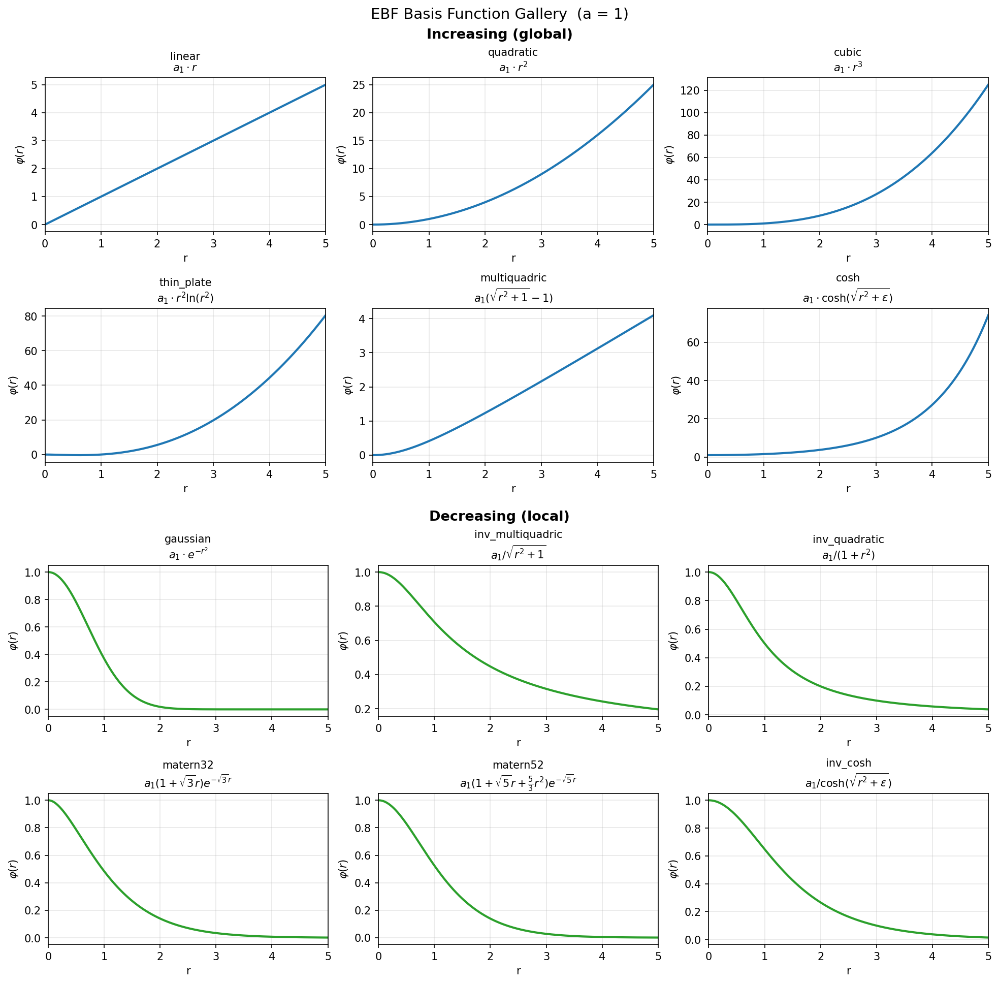

# Basis Functions

The basis function determines how each node's influence changes with distance.
EBF provides 12 basis functions, selected by passing a string name to the
`basis` parameter:

```python
model = ebf.EBF(n_nodes=10, basis='gaussian')
```

## Gallery

The chart below shows all basis functions evaluated with unit weight
($a_1 = 1$) over a range of radii.



## Reference Table

### Growing Functions

These functions increase without bound as distance grows. They produce smooth
surfaces that can extrapolate beyond the data range (for better or worse).

| Name | Expression | When to Use |
|------|-----------|-------------|
| `linear` | $a_1 \cdot r$ | Simple problems; piecewise-linear feel |
| `quadratic` | $a_1 \cdot r^2$ | Smooth parabolic influence |
| `cubic` | $a_1 \cdot r^3$ | Very smooth; similar to natural splines |
| `multiquadric` | $a_1 (\sqrt{r^2+1} - 1)$ | **Default.** Good general choice; grows sub-linearly |
| `cosh` | $a_1 \cdot \cosh(\sqrt{r^2+\varepsilon})$ | Exponential growth at large $r$; use with care |

### Decaying Functions

These functions decay toward zero at large distances. Nodes have localized
influence — far-away nodes don't affect the prediction. Good when you want
the model to avoid wild extrapolation outside the data hull.

| Name | Expression | When to Use |
|------|-----------|-------------|
| `gaussian` | $a_1 \cdot e^{-r^2}$ | Classic localized influence; decays very quickly |
| `inv_multiquadric` | $a_1 / \sqrt{r^2+1}$ | Complement to multiquadric; gentle decay |
| `inv_quadratic` | $a_1 / (1+r^2)$ | Cauchy-like; heavier tails than Gaussian |
| `inv_cosh` | $a_1 / \cosh(\sqrt{r^2+\varepsilon})$ | Sech-like decay; complement to `cosh` |
| `matern32` | $a_1 (1+\sqrt{3}r) e^{-\sqrt{3}r}$ | C1-smooth; popular for physical/engineering data |
| `matern52` | $a_1 (1+\sqrt{5}r+\frac{5}{3}r^2) e^{-\sqrt{5}r}$ | C2-smooth; smoother than Matern 3/2 |

### Special Functions

These have logarithmic behavior near zero.

| Name | Expression | When to Use |
|------|-----------|-------------|
| `thin_plate` | $a_1 \cdot r^2 \ln(r^2)$ | Classic thin-plate spline; C1 smooth |

## Notes

- **$r$** is the non-Euclidean distance from the input point to a node (not
  the squared distance). In the code, the basis functions receive $r^2$
  directly and compute $r$ internally where needed.

- **$\varepsilon$** is a small numerical stability offset (default `1e-8`),
  set via the `eps` parameter on the `EBF` constructor. Only `cosh` and `inv_cosh`
  use it. `thin_plate` uses `tf.math.xlogy` which handles the $r = 0$ case natively.
  All other functions have no singularity at $r = 0$.
