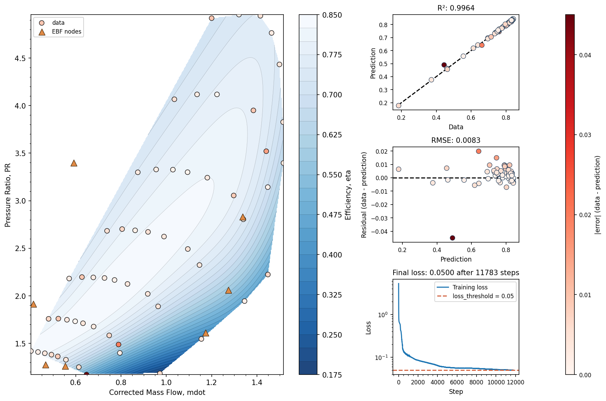

# Example: Compressor Efficiency Map

This walkthrough demonstrates fitting a 2D compressor efficiency map using the
class-based EBF API. The full script is at `examples/comp_map_ebf.py`.

## The Problem

A compressor map relates operating conditions — corrected mass flow and total
pressure ratio — to compressor efficiency. We have scattered test data and want
to produce a smooth efficiency surface for use in cycle simulations.

## The Data

`data/GenericMap.xlsx` holds 56 operating points on a single sheet
named `data`, with one column per variable:

| Column | Meaning | Units | Role |
|--------|---------|-------|------|
| `mdot` | Corrected mass flow | kg/s | input 1 |
| `PR` | Total-to-total pressure ratio | — | input 2 |
| `eta` | Total-to-total efficiency | — | output |

```python
import numpy as np
import ebf
import pandas as pd
from pathlib import Path

data_path = Path("data/GenericMap.xlsx")
df = pd.read_excel(data_path, sheet_name="data")

mdot = df['mdot'].values     # corrected mass flow  (input 1)
PR = df['PR'].values         # pressure ratio       (input 2)
eta = df['eta'].values       # efficiency           (output)

X = np.column_stack([mdot, PR])
```

The input array `X` has shape `(n_points, 2)` and the output `eta` has shape
`(n_points,)`.

## Creating and Training the Model

```python
model = ebf.EBF(
    n_nodes=9,               # number of interpolation nodes
    basis='multiquadric',    # basis function — see ebf.BASIS_FUNCTIONS for all options
    eps=1e-8,                # numerical stability offset
)

model.fit(
    X, eta,                  # inputs and output
    steps=80000,             # optimizer iterations
    lr=0.01,                 # initial learning rate (Adam with exponential decay)
    var_weight=0.01,         # node spread regularization strength
    ellipsoid_weight=0.001,  # ellipsoid shape penalty — explicit smoothness knob (ADR-011)
    loss_type='huber',       # 'rmse' (default), 'huber', or 'tukey'
    huber_delta='auto',      # 'auto' (default) tracks the residual noise floor
    tukey_c='auto',          # Tukey rejection point — 'auto' (default) recommended
    val_fraction=0.0,        # held-out fraction for early stopping (0 = off)
    patience=10,             # val evaluations without improvement before stopping
    verbose=True,            # print training progress every 100 steps
    loss_threshold=0.05,     # early stopping when training loss <= this value
    seed=42,                 # reproducible weight initialization
)
```

**Parameter guidance:**

- `n_nodes` — Start with roughly 1/3 to 1/2 the number of data points. More
  nodes give more flexibility but take longer to train.
- `basis` — `'multiquadric'` is a good default. Try `'gaussian'` or `'matern52'`
  if you want localized node influence. See the
  [Basis Functions](../basis_functions.md) page.
- `var_weight` — Controls how strongly nodes are prevented from collapsing
  together, and is also the primary smoothing knob. Forcing nodes apart causes
  the optimizer to broaden each node's ellipsoidal influence zone (lower
  effective `r` values), producing a smoother surface. Increase `var_weight`
  to smooth the fit; decrease it if the fit is too flat or misses sharp
  features. If nodes visibly cluster together, `var_weight` is too low.
- `ellipsoid_weight` — The explicit smoothness knob (ADR-011). It penalizes the
  mean squared Frobenius norm of each node's ellipsoid factor `L`, which bounds
  how sharp a node's influence zone can get. Unlike `var_weight` it acts on the
  sharpness mechanism directly rather than through node spacing, so reach for it
  first when a fit is too wiggly. `0.0` (default) disables it; small values like
  `0.001` are usually enough.
- `loss_type` — `'rmse'` (default) gives standard least-squares fitting. Use
  `'huber'` for noisy data with outliers (outliers get reduced, linear
  weight), or `'tukey'` when some points are outright erroneous — residuals
  beyond the Tukey rejection point exert zero pull and are effectively
  discarded.
- `huber_delta` — Controls the threshold where Huber loss switches from
  quadratic to linear. The default `'auto'` recalibrates it every 100 steps
  from the current residual spread, so roughly the largest ~18% of residuals
  get linear (outlier-resistant) treatment as the fit tightens. Pass a float
  (in scaled data space) to fix the threshold; lower values make the model
  more aggressive at ignoring outliers.
- `tukey_c` — The Tukey biweight rejection point (only used with
  `loss_type='tukey'`). Keep the default `'auto'`: it tracks the residual
  noise floor at `4.685·σ` and anneals from an effectively quadratic start,
  which protects against rejecting good data early in training.
- `steps` — More steps gives the optimizer more time to converge. Watch the
  loss printout — if it's still decreasing at the end, increase `steps`.
- `loss_threshold` — Stops training early once the training loss is low enough.
  Set to `None` to always run the full number of steps.
- `val_fraction` — Holds out a fraction of the points (e.g. `0.15`) and stops
  training when the held-out loss stops improving for `patience` evaluations,
  then restores the best weights. This is the most reliable way to avoid
  fitting measurement noise, and it replaces guessing `steps` — but it needs
  roughly 50+ data points to give a stable signal. `0.0` (default) disables it.

## Prediction and Inspection

```python
Out = model.predict(X)        # predictions at training points
Nodes = model.get_nodes()     # node positions in original space
print("Node positions:\n", Nodes)

# Per-step training history, stored by fit() — columns are (step, loss)
print(f"Trained for {len(model.history_)} steps, "
      f"final loss {model.history_[-1, 1]:.4f}")
```

`predict()` accepts any `(n_points, 2)` array — it doesn't have to be the
training data. `get_nodes()` returns node positions in the original (unscaled)
coordinate space.

## Saving and Loading

```python
ckpt_path = model.save("checkpoints", filename='compressor-map')
print("Saved to:", ckpt_path)

loaded_model = ebf.EBF.load(ckpt_path)
Out_loaded = loaded_model.predict(X)
```

The checkpoint includes all model weights, the basis function configuration,
and the Scale/Offset values needed to convert between scaled and unscaled space.

## Evaluation and Plotting

The example uses the built-in [visualization utilities](../visualization.md)
to generate three plots with a single function call each:

```python
# Convergence plot — training loss curve with the early-stopping target
ebf.convergence_plot(model, loss_threshold=0.05)

# Correlation plot — data vs prediction with R²
ebf.correlation_plot(eta, Out)

# Contour plot — filled contour of the fitted surface
ebf.contour_plot_2d(
    model, X, eta,
    xlabel='Corrected Mass Flow, mdot',
    ylabel='Pressure Ratio, PR',
    zlabel='Efficiency, eta',
    show_data=True,
    show_nodes=True,
)
```

The contour plot automatically masks predictions outside the convex hull
of the training data so the plot doesn't show misleading extrapolation.

A well-fitted model should achieve R² > 0.99 on this dataset.

## The Summary Figure

`summary_plot_3d()` composes all of the above into one figure — the fitted
surface alongside the three diagnostics:

```python
ebf.summary_plot_3d(
    model, X, eta,
    xlabel='Corrected Mass Flow, mdot',
    ylabel='Pressure Ratio, PR',
    zlabel='Efficiency, eta',
    loss_threshold=0.05,
    show_nodes=True,
    error_color=True,        # the default — shade points by |error|
)
```



56 test points, 9 nodes. The three right-hand panels answer the questions
worth asking of any fit:

- **Correlation** (R² = 0.9964) — is it accurate overall?
- **Residuals** (RMSE = 0.0083, ~1.3% of the 0.184–0.843 efficiency range)
  — is it wrong anywhere in particular? Note the single point near
  prediction 0.5 sitting well below the others; the correlation plot hides
  it against the 1:1 line.
- **Convergence** — training stopped at 11,783 of the 80,000 requested
  steps when the loss reached `loss_threshold=0.05`.

Every data point is shaded by its absolute error, on one scale shared by
all three data panels (colorbar on the far right).  That is what ties the
panels together: the outlier the residual plot isolates is also the
darkest marker on the map, in the low-flow, low-pressure-ratio corner.
Pass `error_color=False` for flat white markers instead.

Two of the nine nodes sit outside the plotted region. `contour_plot_2d`
deliberately clamps the axes to the data bounds, so a node that drifts far
outside during training doesn't stretch the view and shrink the map.

## Exporting a Lookup Table

After fitting, you can evaluate the model on a regular grid and export
the results as a CSV lookup table for use in other programs (Excel,
MATLAB, cycle-deck codes, etc.):

```python
bounds = list(zip(X.min(axis=0), X.max(axis=0)))
grid = ebf.eval_grid(model, bounds, n_points=100)

ebf.export_grid(
    "checkpoints/compressor_map_lookup.csv",
    grid,
    dim_names=['mdot', 'PR'],
)
```

This produces a 10 000-row CSV with columns `Corrected Mass Flow`,
`Total Pressure Ratio`, and `prediction`.  See the
[Visualization](../visualization.md#exporting-lookup-tables) page for
NPZ export and other options.
