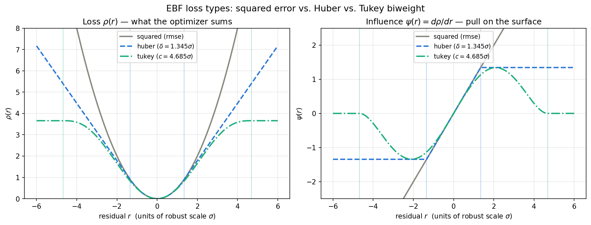
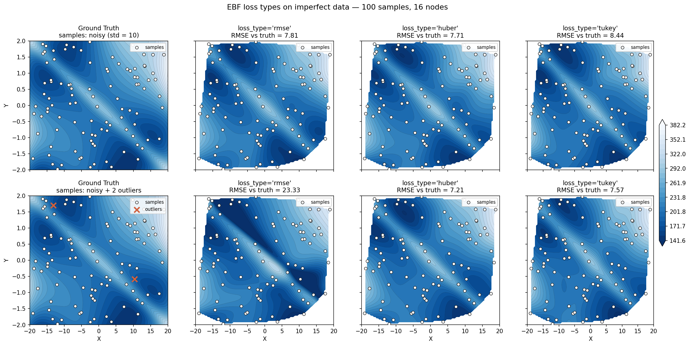

# Loss Types

Real measurements contain noise, and often a few points that are simply wrong.
The `loss_type` parameter controls how hard a residual is allowed to pull on the
fitted surface:

```python
model.fit(X, y, loss_type='huber')     # 'rmse' (default), 'huber', or 'tukey'
```

| `loss_type` | Behavior | Use when |
|-------------|----------|----------|
| `'rmse'` | Squared error — every residual pulls with its full weight | Data is clean |
| `'huber'` | Quadratic core, linear tails — outlier pull is capped | Data is noisy (**recommended default**) |
| `'tukey'` | Redescending — residuals past the rejection point pull with *zero* force | Some points are outright erroneous |

## The Shape of Each Loss



The left panel is $\rho(r)$, the penalty each residual contributes. The right
panel is the **influence** $\psi(r) = d\rho/dr$ — how hard a point at that
residual actually pulls on the surface. The influence curve is the one that
matters for robustness:

- **Squared error** influence grows without bound. A point twice as far away
  pulls twice as hard, so a single bad measurement can dominate the fit.
- **Huber** influence is clipped beyond $\delta$. Outliers still pull, but with
  a constant, bounded force no matter how wrong they are (ADR-009/013).
- **Tukey biweight** influence *redescends* to exactly zero beyond $c$. Points
  out there are effectively deleted from the problem (ADR-014).

Thresholds are drawn at the classical tuning constants used by the `'auto'`
calibration: $\delta = 1.345\sigma$ and $c = 4.685\sigma$, where $\sigma$ is a
robust estimate of the residual scale. Both retain roughly 95% of the
efficiency of least squares on clean Gaussian data.

Regenerate this figure with
[`examples/loss_function_gallery.py`](https://github.com/jreyenga/EBF/blob/main/examples/loss_function_gallery.py).

## Behavior on Real Data

The shapes above predict what happens to a fit, but the effect is easier to see
directly. Below, the same 2-D test surface is sampled 100 times and fit with all
three losses under two corruption scenarios — each fit scored against the
**clean** ground truth, so the numbers measure how well the underlying surface
was recovered.



| Scenario | `rmse` | `huber` | `tukey` |
|----------|-------:|--------:|--------:|
| Noisy (std = 10) | 7.81 | **7.71** | 8.44 |
| Noisy + 2 gross outliers | 23.33 | **7.21** | 7.57 |

Two things to take from this:

**Noise alone is not the problem.** With only Gaussian noise, all three losses
land within about 10% of each other. Tukey trails slightly — its aggressive
rejection also discards genuine sharp features along the diagonal ridge, which
is the cost of redescending influence.

**Gross outliers are.** Adding just *two* bad points out of 100 triples the
squared-error RMSE and tears a visible gash across the surface, because those
two residuals pull harder than everything else combined. Both robust losses
absorb them and hold near 7.2.

Regenerate with
[`examples/loss_comparison.py`](https://github.com/jreyenga/EBF/blob/main/examples/loss_comparison.py).

## Choosing Between Huber and Tukey

**Start with `'huber'`.** In the comparison above it was at least as good as
Tukey in both scenarios, and it degrades gracefully — a mis-set threshold costs
a little accuracy rather than silently discarding good data.

**Reach for `'tukey'`** when outliers are numerous or extreme enough that even
Huber's bounded linear pull still drags the surface. Because Tukey's influence
returns to zero, its total contribution from bad points is finite no matter how
many there are. Raising `n_outliers` or `outlier_size` in
`examples/loss_comparison.py` shows it taking the lead.

!!! warning "Tukey is non-convex"
    A fixed, small `tukey_c` can reject most of the data at initialization and
    stall training before it starts. Keep the default `tukey_c='auto'`, which
    anneals from an effectively quadratic start as the residual scale tightens.

## Adaptive Thresholds

Both `huber_delta` and `tukey_c` default to `'auto'` and are expressed in
**scaled data space**, not your original units — the model standardizes inputs
and outputs internally.

With `'auto'`, the threshold is recalibrated every 100 steps from a robust
(median-absolute-deviation) estimate of the current residual spread. This
matters because the right threshold at step 0, when the surface is still far
from the data, is very different from the right threshold at convergence. As
the fit tightens, the threshold tracks it down.

```python
model.fit(X, y, loss_type='huber', huber_delta='auto')   # recommended
model.fit(X, y, loss_type='huber', huber_delta=0.8)      # fixed threshold
```

Pass a float only when you have a specific reason to pin the threshold; a lower
value makes the model more aggressive about ignoring large residuals.

!!! note
    `huber_delta` is only read when `loss_type='huber'`, and `tukey_c` only when
    `loss_type='tukey'`. Setting one while using the other loss has no effect.

## Related

- [Visualization](visualization.md#residual-plot) — the residual plot is the
  quickest way to judge whether a robust loss is warranted
- [Algorithm Overview](algorithm_overview.md) — where the loss sits in training
- [Decisions](design/DECISIONS.md) — ADR-009, ADR-013, ADR-014
